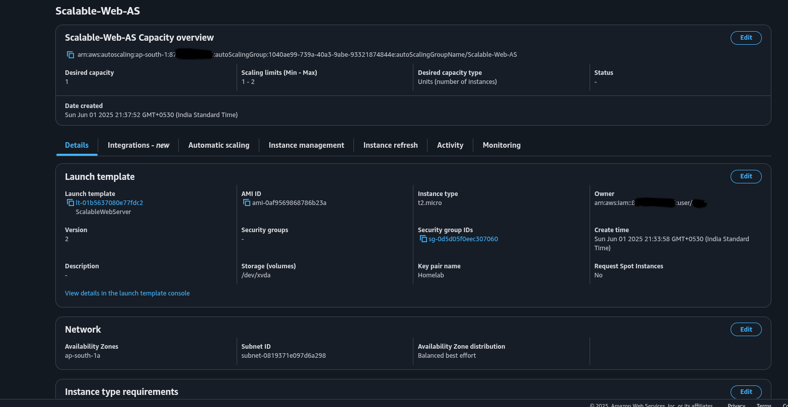

# Scalable Web Application with ALB and Auto Scaling

This project demonstrates a highly available and scalable web application architecture on AWS using Application Load Balancer (ALB) and Auto Scaling Groups. The application displays real-time EC2 instance information with a modern UI.

## Solution Overview

This solution implements a highly available and auto-scaling web application that demonstrates AWS best practices for scalability and resilience. Here's what we've built:

### Infrastructure Components
- **Multi-AZ Deployment**: Application runs across multiple Availability Zones for high availability
- **Auto Scaling**: Automatically adjusts capacity based on CPU utilization (70% threshold)
- **Load Balancing**: ALB distributes traffic evenly across all healthy instances
- **Health Monitoring**: Continuous health checks ensure system reliability

### Application Workflow
1. Users access the application through the ALB endpoint
2. ALB distributes requests across healthy EC2 instances
3. Each instance:
   - Runs a Node.js application on port 80
   - Displays its own metadata (Instance ID, Private IP, etc.)
   - Auto-refreshes data every 30 seconds
   - Uses PM2 for process management and auto-restart

### Auto Scaling Behavior
- **Scale Out**: New instances are added when average CPU > 70%
- **Scale In**: Instances are removed when load decreases
- **Health Checks**: Unhealthy instances are automatically replaced
- **Balanced Distribution**: Instances are distributed across AZs

### Monitoring and Alerts
- **CloudWatch Alarm**: Triggers when instance CPU utilization exceeds 50%
- **SNS Topic**: Sends email notifications for high CPU alerts
- **Real-time Monitoring**: Continuous tracking of instance performance
- **Proactive Scaling**: Alerts help in capacity planning

### Security Considerations
- Security groups control inbound/outbound traffic
- ALB handles SSL/TLS termination (if configured)
- EC2 instances are in private subnets (recommended)
- IMDSv2 is used for secure metadata access

## Architecture

```
┌──────────────┐     ┌──────────────┐
│              │     │  Auto        │
│   ALB        ├─────┤  Scaling     │
│  (Port 80)   │     │  Group       │
└──────────────┘     └──────────────┘
                            │
                     ┌──────┴──────┐
                     │             │
                ┌────┴───┐    ┌────┴───┐
                │  EC2   │    │  EC2   │
                │Instance│    │Instance│
                └────────┘    └────────┘
```

### AWS Components

1. **Application Load Balancer (ALB)**
   - Listens on Port 80
   - Distributes traffic across instances
   - Health checks ensure application availability

2. **Auto Scaling Group**
   - Target Tracking Policy based on CPU utilization
   - Scales out when CPU > 70%
   - Maintains high availability across instances

3. **EC2 Instances**
   - Running Amazon Linux 2023
   - Application runs on Port 80
   - Automated setup using startup script
   - PM2 for process management

## Application Features

- Real-time EC2 instance metadata display
- Modern, responsive UI with glassmorphism design
- Auto-refresh functionality
- Instance details:
  - Instance ID
  - Private IP
  - Instance Type
  - Availability Zone

## Tech Stack

- **Backend**: Node.js with Express
- **Frontend**: HTML5, TailwindCSS, JavaScript
- **Process Manager**: PM2
- **Infrastructure**: AWS (ALB, ASG, EC2)

## Installation and Setup

### Prerequisites
- AWS Account
- AWS CLI configured
- Git

### AWS Infrastructure Setup

1. **Create Application Load Balancer**
   - Type: Application Load Balancer
   - Listener: Port 80
   - Configure security group to allow HTTP traffic

2. **Create Target Group**
   - Protocol: HTTP
   - Port: 80
   - Health check path: /
   - Health check interval: 30 seconds

3. **Create Launch Template**
   - AMI: Amazon Linux 2023
   - Instance type: t2.micro (or as needed)
   - Security group: Allow inbound traffic on port 80
   - User data: Use the startup.sh script

4. **Configure Auto Scaling Group**
   - Use the launch template
   - Configure desired, minimum, and maximum capacity
   - Enable target tracking scaling policy
   - Set target CPU utilization to 70%
   - Attach to ALB target group

5. **Set Up CloudWatch Alarms**
   - Create CPU utilization alarm (50% threshold)
   - Configure SNS topic for notifications
   - Set up email subscriptions
   - Define alarm actions and notifications

### Application Setup

```bash
# Clone the repository
git clone https://github.com/JigarMaheshwari05/Scalable-Web-Application-with-ALB-and-Auto-Scaling.git
cd Scalable-Web-Application-with-ALB-and-Auto-Scaling

# Install dependencies
npm install

# Start the application (for local development)
node app.js
```

### Project Documents

Here the My Website

This sample site which Instance Info like Private IP , instance type, instance ID, and AZ.


Here My Instance running in Auto scaling group


Here my ALB details 


I have setup listener port on 80 and my target group port is 80

Autoscalling Group Details



I have setup target tracking policy ,  on Instance CPU utilization i have set 50% 


Alarms and SNS Topic Details

Alarms


SNS 


## Deployment

The application automatically deploys on EC2 instances using the startup script. The script:
1. Updates system packages
2. Installs Node.js and dependencies
3. Sets up PM2 for process management
4. Starts the application on port 80

## Monitoring and Scaling

### CloudWatch Monitoring
- Monitor CPU utilization through AWS CloudWatch
- Auto Scaling events in ASG Dashboard
- ALB metrics for request counts and latency
- PM2 monitoring on individual instances

### CloudWatch Alarms and Notifications
1. **CPU Utilization Alarm**
   - Threshold: 50% CPU utilization
   - Period: 5 minutes
   - Action: Trigger SNS notification

2. **SNS Topic Configuration**
   - Email notifications enabled
   - Instant alerts when CPU exceeds threshold
   - Notification includes:
     * Instance ID
     * CPU Utilization
     * Timestamp
     * Alarm status

3. **Alert Response Process**
   - Automatic notification to system administrators
   - Enables quick response to performance issues
   - Historical data for capacity planning
   - Integration with incident management workflow

## Architecture Diagram Space

[Reserved for detailed architecture diagram]

You can add a detailed architecture diagram here showing:
- VPC layout
- Multiple Availability Zones
- Security Groups
- Network flow
- Additional AWS services

## Contributing

1. Fork the repository
2. Create your feature branch (`git checkout -b feature/AmazingFeature`)
3. Commit your changes (`git commit -m 'Add some AmazingFeature'`)
4. Push to the branch (`git push origin feature/AmazingFeature`)
5. Open a Pull Request

## License

This project is licensed under the MIT License - see the LICENSE file for details
